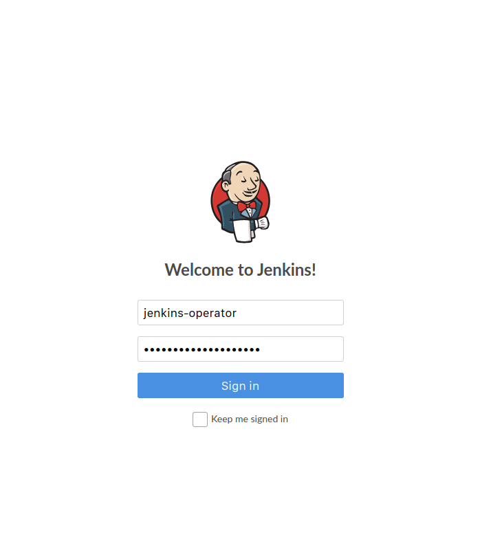
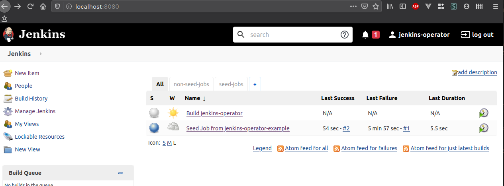
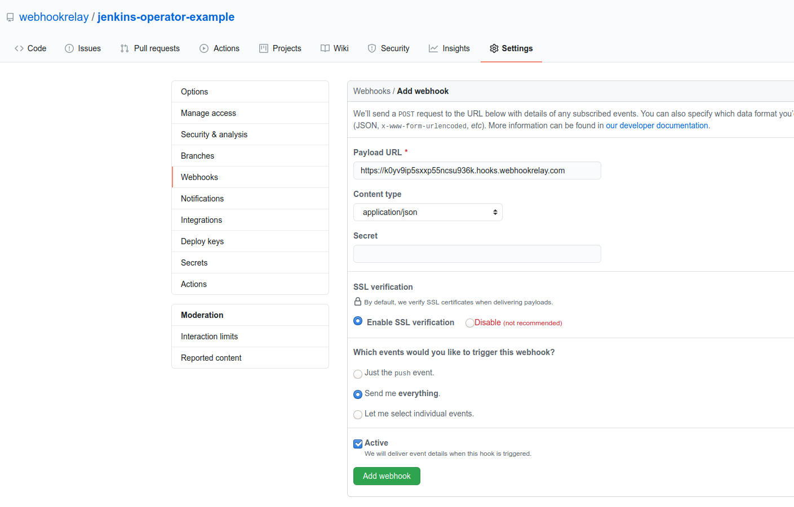
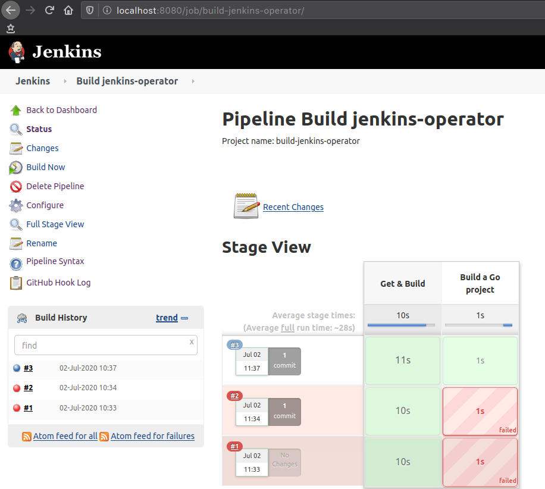

# Jenkins - Webhook Relay operator example

In this example we will create a simple CI system that uses Jenkins to build our example application.

# Short intro

1. Operator works by checking a repo for specific directories in it, more info here https://jenkinsci.github.io/kubernetes-operator/docs/getting-started/latest/configuration/, but the main idea is that you have to prepare pipelines and job definition in your GitHub repository using the following structure:

  ```
  cicd/
  ├── jobs
  │   └── build.jenkins
  └── pipelines
      └── build.jenkins
  ```

2. In this repository I am going to set this up. If you are forking, then just update `cicd/jobs/build.jenkins` and `cicd/pipelines/build.jenkins` with your own fork names.

# Prerequisites

Prerequisites:

* [Helm](https://docs.helm.sh/using_helm/#installing-helm)
* [Webhook Relay account](https://my.webhookrelay.com)
* Kubernetes

# Installation

## Jenkins operator

We begin by installing Jenkins operator:

```
helm repo add jenkins https://raw.githubusercontent.com/jenkinsci/kubernetes-operator/master/chart
helm repo update
helm install jenkins/jenkins-operator
```

Official docs can be found here: https://jenkinsci.github.io/kubernetes-operator/docs/installation/.


Forward traffic to Jenkins:

```
kubectl --namespace jenkins port-forward jenkins-example 8080:8080
```

Lookup username/password (if you have renamed CR, then your secret name will also have a different name):

```
kubectl --namespace jenkins get secret jenkins-operator-credentials-example -o 'jsonpath={.data.user}' | base64 -d
jenkins-operator                                                                                                                                      

kubectl --namespace jenkins get secret jenkins-operator-credentials-example -o 'jsonpath={.data.password}' | base64 -d
oHlaSPMslZr3w
```

And now you can open your browser:



Once you login, you should be able to see a Seed job that has completed and a new "Build jenkins-oeprator" job:



## Webhook Relay Operator

Retrieve your access token key & secret pair from https://my.webhookrelay.com/tokens and set it as an env variable:

```
export RELAY_KEY=xxxxxxxxxxxx
export RELAY_SECRET=xxxxx
```

Add Webhook Relay Operator Helm repository and install it:

```bash
helm repo add webhookrelay https://charts.webhookrelay.com
helm repo update
helm upgrade --install webhookrelay-operator --namespace=jenkins webhookrelay/webhookrelay-operator \
  --set credentials.key=$RELAY_KEY --set credentials.secret=$RELAY_SECRET
```

Now, let's check Jenkins service address so we can configure our webhook forwarding CR:

```
kubectl get svc
NAME                             TYPE        CLUSTER-IP      EXTERNAL-IP   PORT(S)             AGE
jenkins-operator-http-example    ClusterIP   10.102.22.176   <none>        8080/TCP            37m
jenkins-operator-metrics         ClusterIP   10.100.220.49   <none>        8383/TCP,8686/TCP   97m
jenkins-operator-slave-example   ClusterIP   10.96.229.141   <none>        50000/TCP           37m
```

Check out the CR in `webhookrelay_cr.yaml` file and if needed update destination address. Once you are happy with it, let's create it:

```
kubectl apply -f webhookrelay_cr.yaml
```

And once it's created you should be able to view the CR status:

```
$ kubectl describe webhookrelayforwards.forward.webhookrelay.com example-forward
Name:         example-forward
Namespace:    jenkins
Labels:       <none>
Annotations:  API Version:  forward.webhookrelay.com/v1
Kind:         WebhookRelayForward
Metadata:
  Creation Timestamp:  2020-07-01T23:33:12Z
  Generation:          1
  Resource Version:    106773
  Self Link:           /apis/forward.webhookrelay.com/v1/namespaces/jenkins/webhookrelayforwards/example-forward
  UID:                 d56de305-240f-4222-8f89-0dfee70fa804
Spec:
  Buckets:
    Inputs:
      Description:           Endpoint for GitHub
      Name:                  public-endpoint
      Response Body:         OK
      Response Status Code:  200
    Name:                    jenkins-whr-operator
    Outputs:
      Destination:  http://jenkins-operator-http-example:8080/github-webhook/
      Name:         jenkins
Status:
  Agent Status:  Running
  Public Endpoints:
    https://k0yv9ip5sxxp55ncsu936k.hooks.webhookrelay.com
  Ready:           true
  Routing Status:  Configured
Events:            <none>
```

Take the public endpoint URL and add it to your GitHub repository:



Now, any push to your GitHub repository will send a webhook through Webhook Relay to your Jenkins instance that's running inside a Kubernetes cluster.

## Using the pipelines

After a first push or if you trigger the seed job, it will ensure that the pipeline project is set up. At least on the version that I have tested, you first need to start job manually. After it, webhooks will automatically trigger any subsequent builds:



Reference:
- Jenkins Kubernetes Operator: https://github.com/jenkinsci/kubernetes-operator
- Jenkins Operator docs: https://jenkinsci.github.io/kubernetes-operator/docs/getting-started/latest/configuration/
- Jenkins Kubernetes plugin: https://plugins.jenkins.io/kubernetes/
- Jenkins Kubernetes plugin source: https://github.com/jenkinsci/kubernetes-plugin
- Webhook Relay Operator: https://github.com/webhookrelay/webhookrelay-operator/
- Helm (package manager): https://helm.sh/
